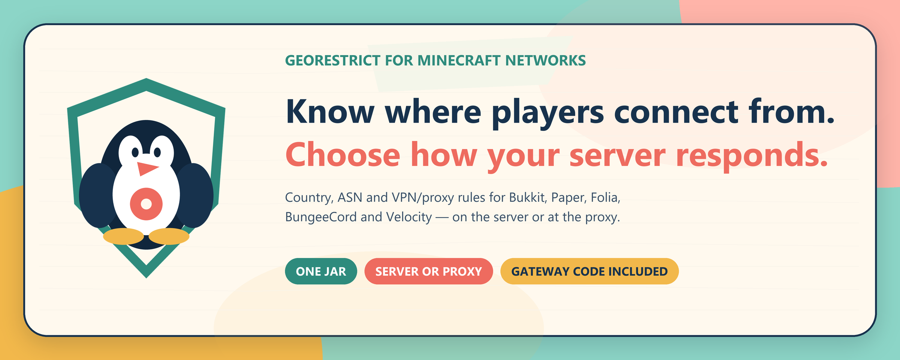

# GeoRestrict
 w
GeoRestrict helps Minecraft server owners decide where connections may come from. It can use country codes, network ASNs and VPN/proxy signals, while keeping recent lookup results in a local cache.

The same **v2.0.0** jar runs on Bukkit, Spigot, Paper, Purpur, Folia, BungeeCord, Waterfall and Velocity. GeoRestrict targets Java 17 bytecode; use a newer Java runtime whenever your server platform requires one.

## Why it exists

Sometimes a community only serves one region. Sometimes a server is being hit by one hosting network. Sometimes an admin needs a broad VPN rule for a short period, then wants to loosen it again. GeoRestrict keeps those decisions in a readable YAML file instead of hiding them in a remote panel.

- Country allowlists and blocklists using ISO two-letter codes
- ASN allowlists and blocklists for network-level control
- Configurable VPN, proxy and hosting detection
- Bounded local cache with atomic saves and expiry cleanup
- Cloudflare Worker gateway with a 24-hour Cache API tier and provider failover
- Protected fallback server that reads Country and ASN data from local MMDB files
- Discord notifications with masked IPs by default
- Manual lookup, cache, purge and reload commands
- Standard aggregate bStats metrics; no player names or IP addresses are sent to bStats

## Start here

1. Download `georestrict-2.0.0.jar` from [Releases](https://github.com/DemonZ-Development/Geo-Restrict/releases).
2. Put it in the server or proxy `plugins/` folder.
3. Restart once so `plugins/GeoRestrict/config.yml` is created.
4. Choose `BLOCKLIST` or `ALLOWLIST`, add the countries you need, then run `/georestrict reload`.

The live field guide covers [installation](https://georestrict-docs.pages.dev/installation), [configuration](https://georestrict-docs.pages.dev/configuration), [commands](https://georestrict-docs.pages.dev/commands), [how the lookup path works](https://georestrict-docs.pages.dev/how-it-works), and [troubleshooting](https://georestrict-docs.pages.dev/troubleshooting).

## A plain-language privacy note

On a plugin-cache miss, the connecting IP is sent to the configured Worker. The Worker checks its 24-hour edge cache, then tries its configured geolocation providers in order. If they all fail, the protected fallback server resolves country and ASN data from local MMDB files. GeoRestrict does not operate a player dashboard or central player log.

The Worker uses Cloudflare's Cache API by default, with a small bounded in-isolate memory cache. An optional KV binding is supported but deliberately disabled unless an operator configures it. Primary country and ASN lookups are powered by [IPinfo Lite](https://ipinfo.io/lite); the fallback server uses monthly [DB-IP Lite](https://db-ip.com/db/lite.php) Country and ASN data under CC BY 4.0.

## Advanced infrastructure reference

Most server owners do not need this section. The generated plugin config points to the public Worker and works without a private token. Do not change the Worker URL or token unless you understand and operate the replacement path.

### Lookup order

```text
Minecraft connection
  -> plugin cache on the Minecraft server
  -> Cloudflare Worker memory and Cache API
  -> IPinfo Lite
  -> IP-API Pro when a key is configured
  -> protected fallback server using local DB-IP Country and ASN files
  -> blockOnLookupFailure policy if no route returns a result
```

The plugin jar contains no geolocation provider URL or provider credential. It sends an uncached address only to `gatewayUrl`. Provider selection, retries and the final fallback route stay behind the Worker.

The production Worker declares its provider endpoints explicitly in [`worker/wrangler.toml`](worker/wrangler.toml). IPinfo Lite is the primary country and ASN source. IP-API Pro is the optional second provider and is skipped when no key is configured. Provider names alone do not activate a hidden URL: an endpoint must be configured for each provider.

### Worker cache and secrets

The default Worker cache lifetime is one day (`CACHE_TTL_SECONDS=86400`). Cloudflare's Cache API is the durable edge tier. A bounded memory cache of up to 5,000 entries helps while an isolate remains warm. Cloudflare KV is supported through an optional `GEO_CACHE` binding but is deliberately unbound in the public deployment.

Run Wrangler commands from `worker/`:

```bash
npm ci
npm test
npx wrangler deploy
npx wrangler secret put IPINFO_TOKEN
```

Only add the secrets you actually use:

| Secret | Needed when |
|---|---|
| `IPINFO_TOKEN` | IPinfo Lite is enabled |
| `IP_API_KEY` | IP-API Pro is enabled |
| `VPS_GATEWAY_URL` | The Worker should use the independent fallback server |
| `VPS_GATEWAY_TOKEN` | Must match a token accepted by that fallback server |
| `GATEWAY_TOKENS` | Optional private Worker access; leave unset for the public Worker |

The `VPS_` names are retained for backward compatibility. They refer to the fallback server, not a requirement to use a particular hosting product. Never commit token values to this repository or place them in `wrangler.toml`.

The public Worker is `https://geoprotect.demonzdevelopment-e64.workers.dev`. The public wiki is `https://georestrict-docs.pages.dev`. Publish wiki changes from the repository root with:

```bash
npx wrangler pages deploy docs --project-name georestrict-docs
```

The fallback server has no public plugin-facing URL. Keep it behind the Worker.

### Independent fallback server

The service in [`vps-gateway/`](vps-gateway/) is the last route, not the public entry point. The Worker calls it only after its external providers fail. It uses local DB-IP Country Lite and ASN Lite MMDB files, so a player lookup makes no further geolocation API request and needs no SQL database.

Install it on a Linux server with Node.js 18 or newer:

```bash
cd vps-gateway
cp .env.example .env
npm ci --omit=dev
npm run update-db
npm test
npm start
```

Keep `HOST=127.0.0.1` and `PORT=8787`. Put Caddy or nginx in front of it, publish HTTPS on TCP port 443, and keep TCP port 8787 closed to the internet. No UDP port is needed. Set a long random `GATEWAY_TOKENS` value in the server `.env`, then store the matching URL and token in the Worker secrets `VPS_GATEWAY_URL` and `VPS_GATEWAY_TOKEN`.

The supplied systemd units are in [`vps-gateway/deploy/`](vps-gateway/deploy/). The service expects `/opt/georestrict-vps/current` to point to a real release directory, such as `/opt/georestrict-vps/releases/20260714214358`, and verifies `current/src/server.js` before starting. The database timer refreshes and validates the local DB-IP files monthly. The historical `georestrict-vps` filenames and `/opt/georestrict-vps` path remain for compatibility; user-facing documentation calls this component the fallback server.

### Release verification

The final v2.0.0 jar passed unit, integration, Worker and fallback server tests. It was also started on real platform runtimes:

| Runtime | Version tested | Result |
|---|---|---|
| Paper | 1.21.11 build 132 | Passed |
| Purpur | 1.21.11 build 2568 | Passed |
| Folia | 1.21.11 build 14 | Passed |
| BungeeCord | Latest successful official build on 15 July 2026 | Passed |
| Waterfall | 1.21 build 615, final official line | Passed |
| Velocity | 4.0.0 build 6 | Passed on Java 25 |

GeoRestrict targets Java 17 bytecode, but the platform can require a newer runtime. Follow the runtime requirement of the server or proxy version you install.

## Commands

| Command | What it does |
|---|---|
| `/georestrict check <ip\|player>` | Shows the lookup result used by the rule engine |
| `/georestrict cachestats` | Reports local cache size and hit information |
| `/georestrict purgecache` | Clears cached lookups |
| `/georestrict reload` | Validates and reloads `config.yml` |
| `/georestrict` | Shows plugin information and version |

`georestrict.admin` grants admin commands. `georestrict.bypass` skips enforcement on Bukkit-compatible backend servers, where live player permissions are available at login.

## Build and test

```bash
mvn -B clean verify
cd worker && npm test
node --check worker/src/index.js
node --check vps-gateway/src/server.js
```

The shaded jar is written to `target/georestrict-2.0.0.jar`.

The integration and real platform startup harnesses are documented in [`test/README.md`](test/README.md).

## Project history

GeoRestrict was created by [linuxaddict](https://modrinth.com/user/linuxaddict) and is now maintained by the [Demonz Development](https://demonzdevelopment.online/) open-source community. Listening to users comes first: bring bugs, reports and honest feedback to our [Discord community](https://discord.com/invite/GYsTt96ypf) or the [issue tracker](https://github.com/DemonZ-Development/Geo-Restrict/issues).

Before running GeoRestrict for a public community, read the [Privacy Policy](https://georestrict-docs.pages.dev/privacy) and [Terms and Conditions](https://georestrict-docs.pages.dev/terms).

Released under [GPL-3.0](LICENSE).
